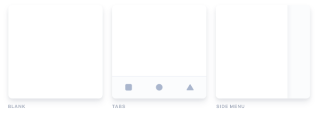
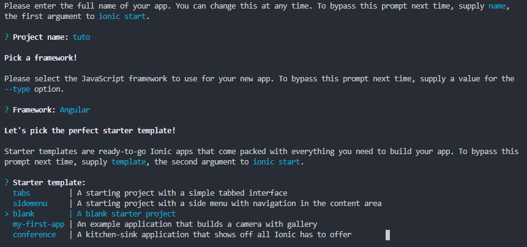
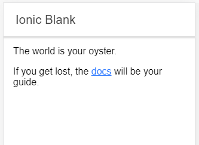
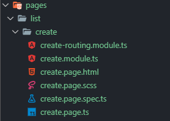

# IHM-Ionic

## Require

__Pour l'installation :__
  - [x] NodeJS
  - [x] npm
  
__Environnement de développement :__

__Languages et/ou compétences__
  - [x] Angular
  - [x] HTML
  - [x] CSS
  
## Installation d'Ionic

Le lien d'installation vers le site d'ionic : https://ionicframework.com/docs/installation/cli

### Installation
```
npm install -g ionic
```
### Création d'un projet

Les différent templates de projet de base :



Nous choississons de créer un projet vide pour ce tutoriel.
```
ionic start tuto
```
Pour notre tutoriel nous choisirons de construire un projet angular et le template blank



### Lancement du projet

On lance le projet :

```
cd tuto
ionic serve
```

On obtient :



## Environnement de développement
https://ionicframework.com/docs/components

## Création d'une applcation (todolist)

### Génération d'une page

On génère une page :

```
ionic generate page pages/list/create
```

Il est conseillé de regrouper ces pages dans un seul et même dossier.



Pour cela on déplacera notre page Home dans pages.

### Routing

Ionic comporte une multitude composant de base

I think you should use an
`<addr>` element here instead.

```javascript
function fancyAlert(arg) {
  if(arg) {
    $.facebox({div:'#foo'})
  }
}
```


- [x] @mentions, #refs, [links](), **formatting**, and <del>tags</del> supported
- [x] list syntax required (any unordered or ordered list supported)
- [x] this is a complete item
- [ ] this is an incomplete item


First Header | Second Header
------------ | -------------
Content from cell 1 | Content from cell 2
Content in the first column | Content in the second column
