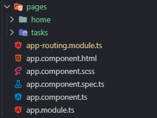
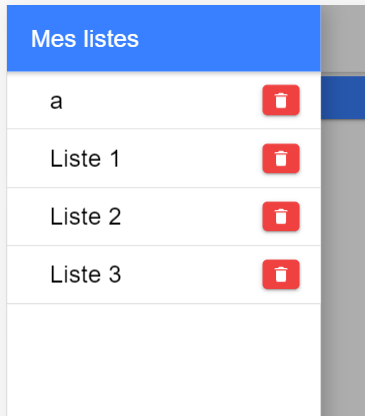

# IHM-Ionic

## Sommaire

- [Installation](https://github.com/zYmMiJ/IHM-Ionic/blob/master/README.md#installation-dionic)

  - [Installation d'un projet](https://github.com/zYmMiJ/IHM-Ionic/blob/master/README.md#installation)
  
  - [Création d'un projet](https://github.com/zYmMiJ/IHM-Ionic/blob/master/README.md#cr%C3%A9ation-dun-projet)

  - [Lancement d'un projet](https://github.com/zYmMiJ/IHM-Ionic/blob/master/README.md#lancement-du-projet)

- [Création d'une application](https://github.com/zYmMiJ/IHM-Ionic/blob/master/README.md#cr%C3%A9ation-dune-application-todolist)
  
  - [Création d'une page](https://github.com/zYmMiJ/IHM-Ionic/blob/master/README.md#g%C3%A9n%C3%A9ration-dune-page)

  - [Création d'un composant](https://github.com/zYmMiJ/IHM-Ionic/blob/master/README.md#g%C3%A9n%C3%A9ration-dune-page)
  
  - [Création d'un module](https://github.com/zYmMiJ/IHM-Ionic/blob/master/README.md#cr%C3%A9ation-dun-module)
  
     - [Partage de composant](https://github.com/zYmMiJ/IHM-Ionic/blob/master/README.md#partage-de-composant)
     
  - [Création d'un service](https://github.com/zYmMiJ/IHM-Ionic/blob/master/README.md#cr%C3%A9ation-dun-service)

  - [Rooting](https://github.com/zYmMiJ/IHM-Ionic/blob/master/README.md#routing)
  
  - [Theming](https://github.com/zYmMiJ/IHM-Ionic/blob/master/README.md#theming)

- [Build](https://github.com/zYmMiJ/IHM-Ionic/blob/master/README.md#build)

  - [Android](https://github.com/zYmMiJ/IHM-Ionic/blob/master/README.md#android)
  
  
## Require

__Pour l'installation :__
  - [x] NodeJS
  - [x] npm
  
__Environnement de développement :__

__Languages et/ou compétences__
  - [x] Angular
  - [x] HTML
  - [x] CSS
  
## Installation d'Ionic

Le lien d'installation vers le site d'ionic : https://ionicframework.com/docs/installation/cli

### Installation
```
npm install -g ionic
```
### Création d'un projet

Les différent templates de projet de base :


Nous choississons de créer un projet vide pour ce tutoriel.
```
ionic start tuto
```
Pour notre tutoriel nous choisirons de construire un projet angular et le template blank


### Lancement du projet

On lance le projet :

```
cd tuto
ionic serve
```

On obtient :


## Création d'une application (todolist)

### Création d'une page

On génère une page :

```
ionic generate page pages/tasks/create
```

Il est conseillé de regrouper ces pages dans un seul et même dossier.



Pour cela on déplacera notre page Home dans pages comme ci-dessus.

Puis pour la suite de ce tuto nous créons  d'autres pages:

```

``` 

### Création d'un composant


Notre application comportera différents composants :

```
ionic generate component components/side-menu
ionic generate component components/tasks
```

Nous créons un composant ionic side-menu :

Dans `side-menu\side-menu.component.html` remplacer le code existant par:

```html
<ion-menu side="start">

  <ion-header>
    <ion-toolbar color="primary">
      <ion-title>Mes listes</ion-title>
    </ion-toolbar>
  </ion-header>

  <ion-content>
       
    <ion-list lines="none">
    </ion-list>
    
  </ion-content>

</ion-menu>
<ion-router-outlet main></ion-router-outlet>
```

Nous le déclarons dans notre `home/home.module.ts` :

```typescript
declarations: [HomePage,SideMenuComponent]
```

Nous pouvons ainsi utiliser dans notre `home/home.page.html` le selecteur :

```html
<app-side-menu></app-side-menu>
```

et ajouter le bouton, dans la toolbar du header:

```html
<ion-header>
  <ion-toolbar>
    <ion-buttons slot="start">
      <ion-menu-button></ion-menu-button>
    </ion-buttons>
    <ion-title>
      Ionic Blank
    </ion-title>
  </ion-toolbar>
</ion-header>
```
On obtient en finale ceci :


### Création d'un module

#### Partage de composant

### Création d'un service

### Création d'une modal Page

Création d'une page modal :

```
ionic g page example-modal
```

Ajouter dans `app.module.ts` dans imports :

`import { ExampleModalPageModule } from './example-modal/example-modal.module';`

et en dernier dans @NgModule imports : []

`ExampleModalPageModule`

### Routing

Pour IONIC 5:Angular il est conseiller de d'utliser Angular rooter : https://angular.io/guide/router.

La définition des routes se fait dans le fichier `app-rooting.module.ts` .

Lors de la création d'une page une route est créer automatiquement, comme ici pour notre pagre list/create :


Pour accéder à notre page il suffit d'ajouter à une balise :


### TodoList

Une fois toutes nos pages,modules,services,composants créés, la structure de notre projet est celle-ci:


#### Navigation vers une autre page

Dans `pages/home/home.page.html`, vous ajouterez ce bouton :

```html
<ion-content>
  
  <!-- Bouton ajout d'une nouvelle tache -->
  <ion-fab vertical="bottom" horizontal="end" slot="fixed">
    <ion-fab-button size="small" color="primary" routerLink="/createTask" routerLinkActive="active">
      <ion-icon name="add"></ion-icon>
    </ion-fab-button> 
  </ion-fab>
  
</ion-content>
```

Ce bouton doit vous renvoyer vers la page `create\tasks`, cependant cela ne fonctionne pas il faut modifier la route par défaut.

Modifiez cette route dans `app-rooting.module.ts` comme ceci :


Ionic fournit aussi des outils de navigation comme le retour arrière.

Remplacer le code html présent dans `tasks/create/create.page.html` par : 

```html
<!-- Back button with custom text and icon -->
<ion-header>
  <ion-toolbar> 
    <ion-title>Création de tâches</ion-title>
    <ion-buttons slot="start">
      <ion-back-button
          [text]="buttonText"
          [icon]="buttonIcon">
      </ion-back-button>
    </ion-buttons>
  </ion-toolbar>
</ion-header>
```
Vous obtenez ceci :


#### Modal Page

Pour accéder à notre modal page créer auparavant, nous créons un bouton qui lancera cette modal Page.

Copiez ce code dans le content de `pages/home/home.page.html` :

```html
  <ion-button expand="block" (click)="openModal()">Créer Liste</ion-button>
```

Comme vous pouvez le voir on déclare un event click qui lancera une fonction openModal().

Dans `pages/home/home.ts` ajoutez :

```typescript
export class HomePage {

  dataReturned: any;

  constructor(public modalController: ModalController) {}

  async openModal() {

    const modal = await this.modalController.create({
      component: ExampleModalPage,
    });
  
    modal.onDidDismiss().then((dataReturned) => {
      if (dataReturned !== null) {
        this.dataReturned = dataReturned.data;
        //alert('Modal Sent Data :'+ dataReturned);
      }
    });
 
    return await modal.present();
  }

}
```

On obtient:


Puis dans `example-modal/example-modal.html` :

```html
  <div class="ion-padding">
    <ion-button (click)="dismissModal()" expand="block" type="submit" color="warning" class="ion-no-margin">Close</ion-button>
  </div>
```

et dans `example-modal/example-modal.ts`:

```typescript
constructor(private modalCtrl:ModalController) {}
```

```typescript
    dismissModal() {
      this.modalCtrl.dismiss({
        'dismissed': true
      });
    }
```

On obtient:


#### Ionic data storage

Installation du plugin cordova :

```
ionic cordova plugin add cordova-sqlite-storage
```

Installation du package :

```
npm install --save @ionic/storage
```

Dans `example-modal/example-modal.page.ts` : 

Importez:

`import { Storage } from '@ionic/storage';`

Déclarez dans la classe :

```typescript
  listName : string;
  listObj : any = [];
```

Ajouter dans le constructor:

```typescript
 constructor(private storage: Storage,private modalCtrl:ModalController)
```

Puis les fonctions suivantes :

```typescript

  handleListNameValue(event) {
    console.log("ListName :");
    console.log(event.target.value);
    this.listName = event.target.value;
  }

  AddList(){
    this.storage.get('Listname').then((val) => {
      console.log('Get de la BDD :', val);
      if ( val != null ){
        var tmp:any[] = new Array();
        tmp = val;
        this.listObj = tmp;
      }else{
        this.listObj = new Array();
      }
      this.listObj.push({ name : this.listName });
      // set a key/value
      this.storage.set('Listname', this.listObj);
    });
    this.dismissModal();
  }

  removeAllList(){
    this.storage.remove('Listname');
  }

  view(){
    this.storage.get('Listname').then((val) => {
      console.log('Get de la BDD :', val);
      var tmp:any[] = new Array();
      tmp = val;
      this.listObj = tmp;
    });
  }
```

Dans le html `example/example.page.html` ajoutez les boutons et le formulaires suivants suivants :

```html

  <form>
    <ion-list lines="full" class="ion-no-margin ion-no-padding">
      <ion-item>
        <ion-label position="stacked">Nom de Liste<ion-text color="danger">*</ion-text></ion-label>
        <ion-input required value="" type="text" (ionInput)="handleListNameValue($event)"></ion-input>
      </ion-item>
    </ion-list>
  </form>

  <div class="ion-padding">
    <ion-button (click)="AddList()"  expand="block" type="submit" class="ion-no-margin">Créer Liste</ion-button>
  </div>
  
  <div class="ion-padding">
    <ion-button (click)="removeAllList()" expand="block" type="submit" color="danger" class="ion-no-margin">removeAll</ion-button>
  </div>

  <div class="ion-padding">
    <ion-button (click)="view()" expand="block" type="submit" color="success" class="ion-no-margin">View</ion-button>
  </div>
```

Dans `app.module.ts` :

Déclarez l'import :

```typescript
import { IonicStorageModule } from '@ionic/storage';
```

et importez le:

```typescript
  IonicStorageModule.forRoot({
    name: '__mydb',
    driverOrder: ['indexeddb', 'sqlite', 'websql']
  }),
```

On obtient:


Nous voulons maintenant afficher nos listes créer dans notre side-menu.

Ajoutez ceci dans vontre content de `side-menu/side-menu.component.html`:

```html
  <ion-content>
       
      <ion-item lines="full" *ngFor="let listname of listnames; let i = index">
        <ion-title>{{listname.name}}</ion-title>
      </ion-item>

  </ion-content>
```

La fonction qui rafraichira nos listes dans `side-menu/side-meu.component.ts`:

```typescript
import { Component, OnInit } from '@angular/core';
import { Storage } from '@ionic/storage';
@Component({
  selector: 'app-side-menu',
  templateUrl: './side-menu.component.html',
  styleUrls: ['./side-menu.component.scss'],
})
export class SideMenuComponent implements OnInit {

  listnames: any = [];
  
  constructor(private storage: Storage) { }

  ngOnInit() {}

  menuOpened() {
    console.log("OnOpen");
    this.storage.get('Listname').then((val) => {
      if ( val != null ){
        var tmp:any[] = new Array();
        tmp = val;
        this.listnames = val;
      }else{
        this.listnames = new Array();
      }
    });
  }
}

```

Pour supprimer une liste ajoutez la fonction:
```typescript
  remove(i){
    console.log('remove :'+i);
    console.log(this.listnames[i]);
    this.listnames.splice(i,1);  
    this.storage.set('Listname', this.listnames);
  }
```

et le button suivant:

```html
        <ion-item lines="full" *ngFor="let listname of listnames; let i = index">
          <ion-title>{{listname.name}}</ion-title>
          <ion-button (click)="remove(i)" color="danger"><ion-icon name="trash"></ion-icon></ion-button>
        </ion-item>
```

Visullement on obtient ceci:



### Theming


### Composants Graphiques

Ionic comporte une multitude de composant de base que vous pouvez retrouver ici : https://ionicframework.com/docs/components . Cette doc renseigne aussi les différentes propriétés, events, methods, personnalisation css etc... et un exemple d'usage d'un composant.

## Build

### Android
